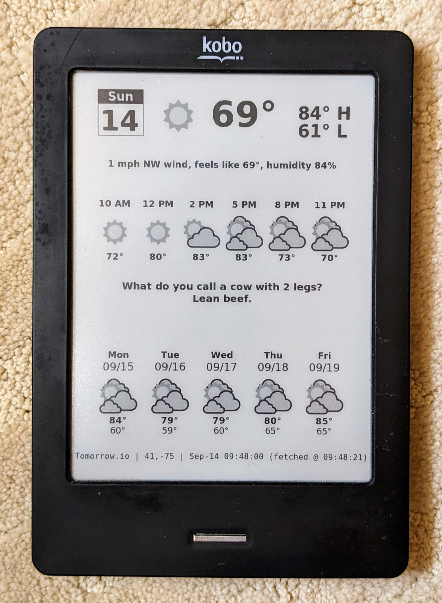

# Kobo-Weather-Station
Turn an old Kobo e-Reader into a 1.5-watts Linux server and always-on e-ink weather station. This guide walks you through the steps to configure and running a script that displays weather images on the screen.



# Kobo Touch (N905) – Weather Station Setup

This guide covers installing **Nickel Menu**, **FBInk** and setup **Weather Station** on the Kobo Touch (N905).

---

## ⚠️ Disclaimer

- These steps involve modifying firmware and system files.  
- Mistakes can **brick your Kobo** or require manual recovery via the internal SD card.  
- Proceed only if you are comfortable with Linux command-line tools and Kobo internals.  

---

## Requirements

| Item | Description |
|---|---|
| Kobo Touch N905 | Tested device model. |
| USB cable + computer | To copy files to the `.kobo` directory. |
| Access to hidden folders | Must be able to see `.kobo` and `.adds`. |
| [Nickel Menu release](https://github.com/pgaskin/NickelMenu/releases) | Provides menu customization. |
| [FBInk info](https://www.mobileread.com/forums/showthread.php?t=299110) | For displaying weather PNG files. |

---

## Step 1: Install Nickel Menu

1. Download the latest `KoboRoot.tgz` from the [Nickel Menu releases page](https://github.com/pgaskin/NickelMenu/releases).  
2. Connect the Kobo Touch to PC via USB.  
3. Copy `KoboRoot.tgz` into the `.kobo` folder.
4. Safely eject the device.  
5. The Kobo will reboot and install Nickel Menu automatically.  

✅ At this point, Nickel Menu is active (accessible via the **Nickel Menu** on the home screen).  

---

## Step 2: Install FBInk

`FBInk` allows scripts to print text or display images on the Kobo screen.  

1. Download the `fbink` binary from the [FBInk discussion page](https://www.mobileread.com/forums/showthread.php?t=299110).
2. Connect the Kobo Touch to PC via USB.
3. Copy `KoboRoot.tgz` into the `.kobo` folder.
4. Safely eject the device.  
5. The Kobo will reboot and install FBInk automatically.  

---

## Step 3: Setup Weather Web Server

In order to turn Kobo into a weather station, a web server is needed to use APIs from weather providers, and render it into a Kobo screen sized picture. Then the script running on the Kobo device can fetch the picture periodically and display it.<p>

For this purpose, we can use a docker image on a Raspberry Pi, local server or cloud VM (if cloud VM is used, it's recommended to enable firewall to only allow connection from your public IP). <p>

The docker image to be used is: https://hub.docker.com/r/gadget1999/rpi-nook-weather. <p>

Get the following information: Weather providers API Keys (NWS or Tomorrow.io) <br>
An example script to run the image can be found here: Run weather web server container <br>
Once the web server is running, you can use this URL to get the weather info in 600x800 PNG: https://yourserver:port/kindle_image?gps_coordinates=39.7128,-76.0060 (replace with your own GPS coordinates) <br>
With the container image, you can provide quotes to display (mine example shown is jokes, but you can use, e.g., quotes of the day)

## Step 4: Copy weather station script files

1. Download the files in this repo.
2. Connect the Kobo Touch to PC via USB.
3. Copy the folders under `Kobo\mnt\onboard\.adds` (`nm` and `bin`) into the `.adds` folder.
4. Update the file `Kobo\mnt\onboard\.adds\bin\.env`, change `KINDLE_WEATHER_URL` value to your web server and GPS coordinates above
5. Safely eject the device.

Now there will be 2 menu entries in Nickel Menu: `Start Weather` and `Start Telnet`

## Step 5: Start weather station

Select `Start Weather` in `Nickel Menu`, this will start the weather station. <p>

A few notes about the weather script:
- It uses /tmp tmpfs to keep the updated PNG files, to avoid wearing out the internal storage
- It will also disable Kobo native UI so that screen is not overwritten by native UI periodically. Another important reason is that the native UI aggressively disconnects WiFi, so weather updates will fail.
- If you need to switch back to native Kobo UI later, just use the power button to turn off the device and start again.

---

## References

* [Nickel Menu GitHub](https://github.com/pgaskin/NickelMenu)
* [FBInk GitHub](https://github.com/NiLuJe/FBInk)
* [Kobo Development Forum on MobileRead](https://www.mobileread.com/forums/forumdisplay.php?f=247)

```
